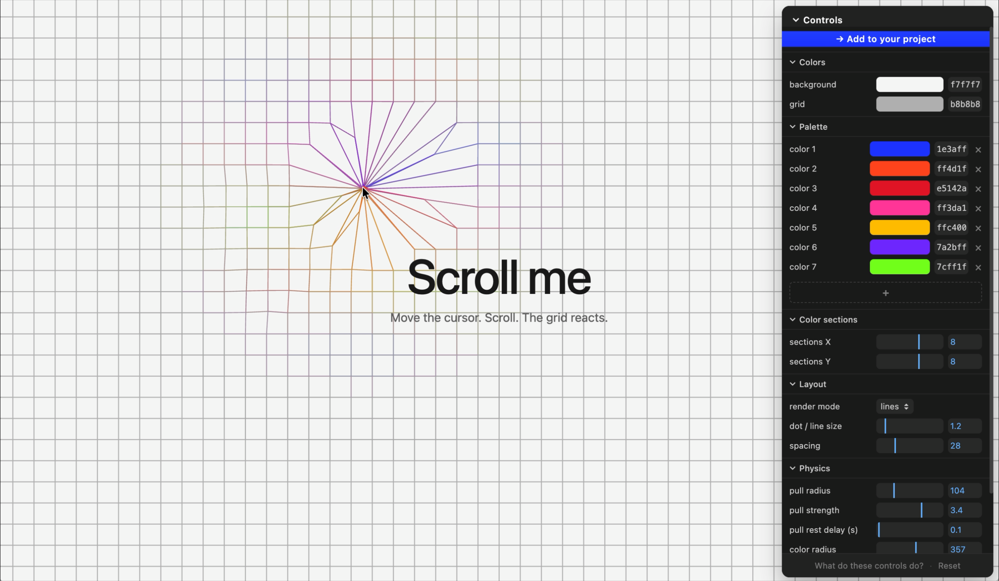

# Iridesce

An animated, interactive dotted-grid background for the web. Cursor-driven physics, scroll reactivity, and a palette-based color field that only blooms where you point.

## Demo & playground

The live playground is the configurator. Tweak it until it feels right, then take it with you.

→ **[ivngmz.com/playground](https://ivngmz.com/playground/)**

Move your cursor. Scroll. Open the controls panel and adjust colors, palette, color sections, layout, and physics. Everything previews in real time.

## How to use it in your project

There's no `npm install`. Iridesce is a single-file Canvas2D component you drop into your codebase — and the playground hands it to you, configured.

1. Open the playground and dial in the look you want.
2. Click **→ Add to your project** at the top of the controls panel.
3. Copy the generated prompt.
4. Paste it into your AI coding assistant (Claude Code, Cursor, Copilot, etc.).

The prompt contains:

- The full `grid.ts` source — no dependencies
- Your exact playground config as JSON
- Mounting instructions for React, Next, Astro, Vue, Svelte, Solid, or vanilla
- The right CSS for full-viewport coverage on mobile (including `100lvh` to handle iOS Safari's collapsing URL bar)

Your assistant takes it from there.

## Features

- **Canvas2D, no dependencies.** One file, ~500 lines.
- **Cursor physics.** Anchored grid points get tugged toward (or away from) the cursor with falloff, then spring back with damping.
- **Scroll reactivity.** Vertical scroll velocity kicks the grid; the kick decays over a few frames.
- **Palette color field.** Each grid corner has a color from your palette; bilinear blending fills in the rest. The colored field is only revealed within a radius of the cursor — the rest stays in the neutral grid color.
- **Two render modes.** Render as dots or as connecting lines.
- **Tunable physics.** Pull radius, pull strength, rest delay, spring stiffness, damping, scroll strength — all live in the config.

## License

MIT.
